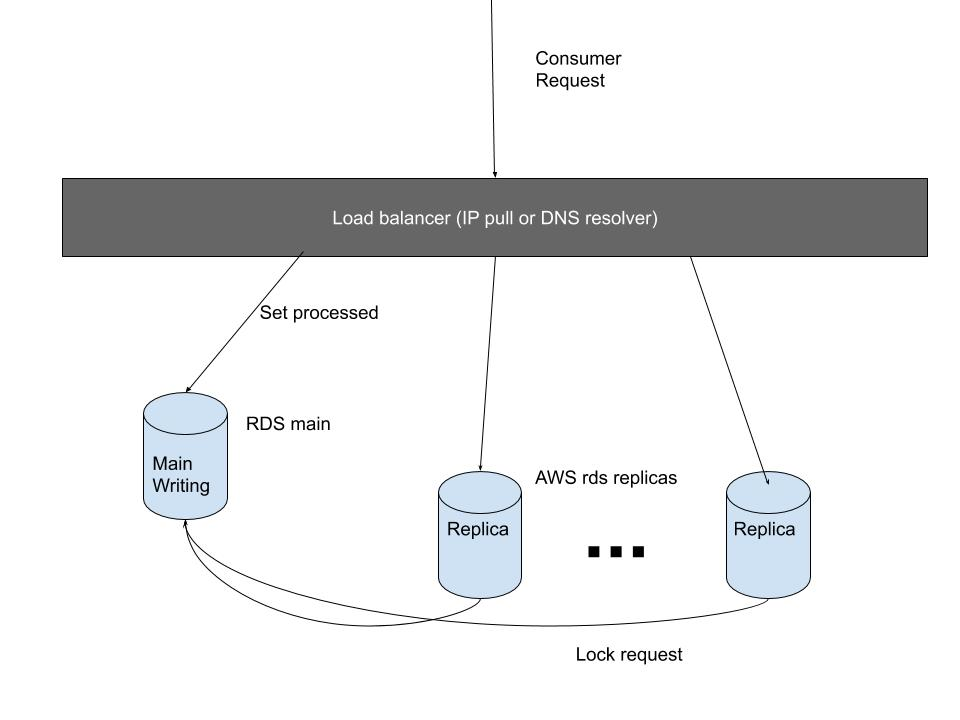

# Scalling

## Possible implementations

Very-high scalable system possibilities:

- [Scalling](#scalling)
  - [Possible implementations](#possible-implementations)
    - [**1 - Infrastructure**](#1---infrastructure)
    - [**2 - Source code**](#2---source-code)
    - [**3 - Eventual consistency**](#3---eventual-consistency)
    - [**4 - Pull of replicas with local repositories**](#4---pull-of-replicas-with-local-repositories)
  - [Tools](#tools)

### **1 - Infrastructure**

We need to have a pull of read replicas to access the messages. These replicas have their own mutual exclusion requests writing to the main repository.

To supply a high demanding network requests these replicas must be accessed via load-balancer, which could be a backbone with a DNS resolver switch or an IP range sub-network broadcast request.

### **2 - Source code**

The definition of requesting messages and after marking them as processed, one by one, requires a mechanism of locking the message, via database metadata or via mutex on local process (but this could come to be an eventual consistency).

To achieve a more independent local service replica, once the messages are requested, the process of wonderq respond with data and before sending it, deletes the messages from main repository as if they were processed.

This approach could lead to consumers to not process a message and it could not be retrieved again once it's not present anymore.

### **3 - Eventual consistency**

Another possibility, depending on the needed scenario, to achieve a more scalable system, it would be possible to define replicas with local consistency. A main repository when defining that a message is locked, this writing request would happen async, detached from retrieve.

This could lead to some consumers processing the same message.

### **4 - Pull of replicas with local repositories**

Another approach to improve scalability is to create wonderq process instances responding from an IP pull. Each instance have it's own local read/write repository and respond with an specific header of SOURCE. With this SOURCE (IP or sub-domain) the consumer can mark processed and it continues with the consistency and it doens't depends on external writing to lock the messages to be replicated.

One possible issue is that a consumer have less transparency and find it handling the direct requests to one specific wonderq instance.

## Tools

Using RDS main and instance replicas would be possible to defined the infrastructure environment needed.

